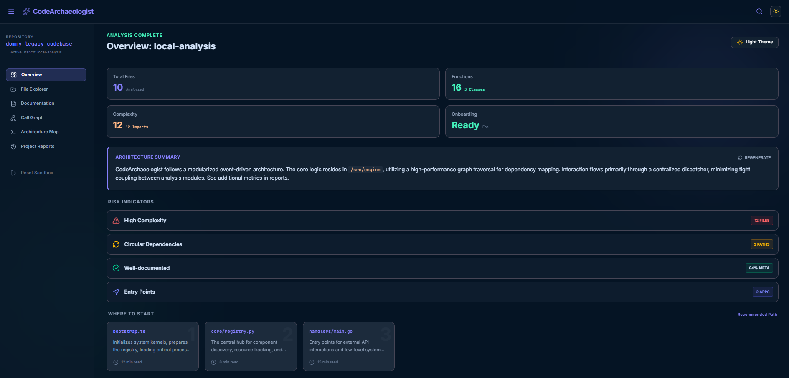
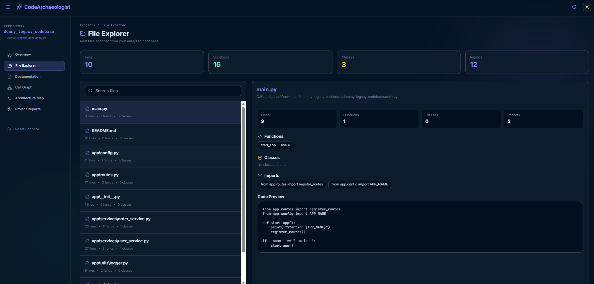
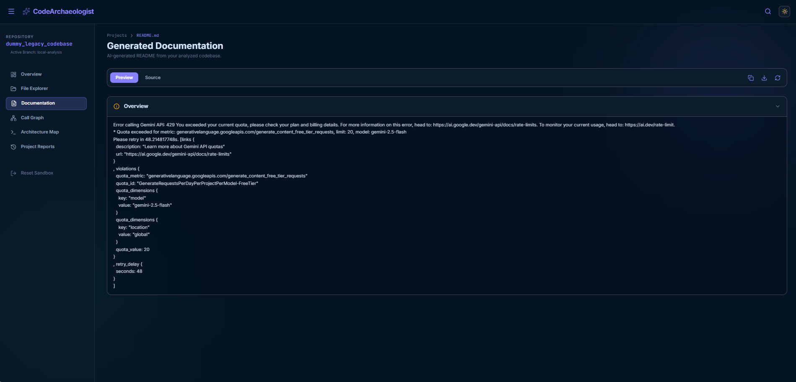
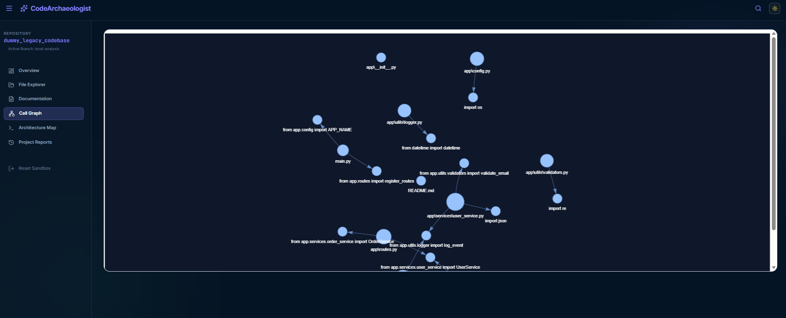
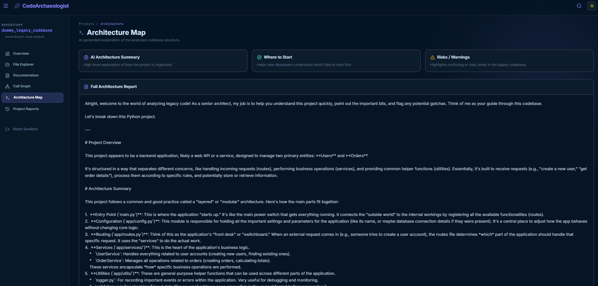
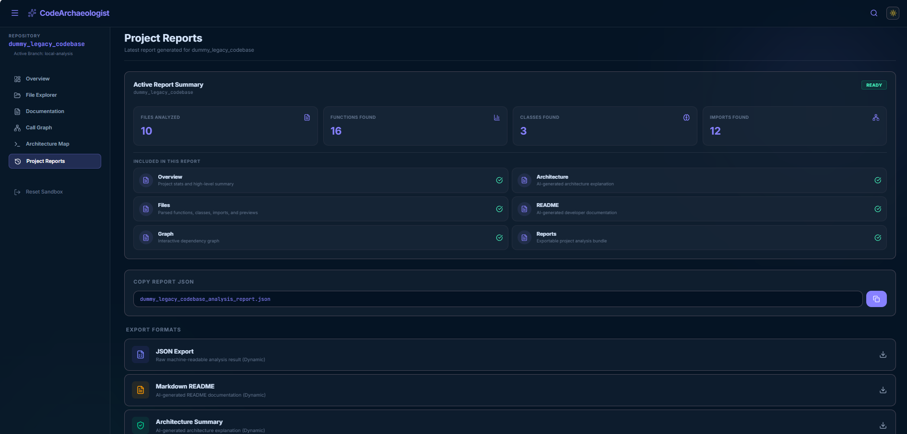
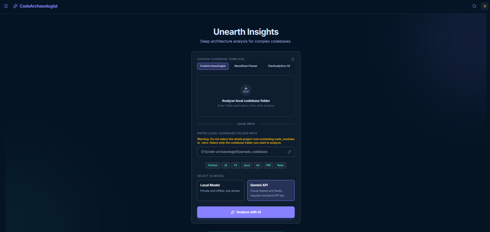

# Code Archaeologist Workspace

<p align="center">
  
</p>
<p align="center">
  
</p>
<p align="center">
  
</p>
<p align="center">
  
</p>
<p align="center">
  
</p>
<p align="center">
  
</p>
<p align="center">
  
</p>

A clean, professional monorepo-style structure combining the frontend and backend of the Code Archaeologist project.

## Directory Structure

```text
/
├── backend/                  # Python Flask Backend
│   ├── src/                  # Code analysis parser, AI engine, graph builder
│   ├── outputs/              # Analysis output directory (reports, graphs, Architecture Summary)
│   ├── sample_codebase/      # Sample codebase for scanning
│   ├── tests/                # Unit tests
│   ├── app.py                # Flask main entrypoint
│   └── requirements.txt      # Python dependencies
│
├── frontend/                 # Vite React TypeScript Frontend
│   ├── src/                  # React source files (App.tsx, components, etc.)
│   ├── assets/               # Frontend asset files
│   ├── index.html            # Main HTML entrypoint
│   ├── package.json          # Frontend dependencies & scripts
│   ├── tsconfig.json         # TypeScript configuration
│   └── vite.config.ts        # Vite configuration
│
├── .gitignore                # Workspace gitignore
├── package.json              # Root script runner for concurrent executionS
└── README.md                 # This documentation about  project 
```

## Prerequisites

- **Node.js**: v18+ and `npm`
- **Python**: v3.10+
- **Ollama** (optional, for local AI functionality)

### Installation

### 1. Root and Frontend Dependencies
Install root developer dependencies (like `concurrently` to run both services) and frontend dependencies:
```bash
npm install
npm run install:frontend
```

### 2. Backend Dependencies
Ensure you have activated your virtual environment (e.g. the workspace `.venv`), and install backend requirements:
```bash
# Windows (PowerShell)
.venv\Scripts\Activate.ps1

# Windows (Command Prompt)
.venv\Scripts\activate.bat

# macOS/Linux
source .venv/bin/activate

# Install requirements
pip install -r backend/requirements.txt
```

## Running the Application

To run **both** the frontend and backend simultaneously in development mode, run from workspace root:
```bash
npm run dev
```
*(you can also run `npm start`)*

This starts:
- The React Frontend on [http://localhost:3000](http://localhost:3000)
- The Flask Backend on [http://localhost:5000](http://localhost:5000)

### Running Services Separately
If you prefer running them in separate terminals:
- **Frontend**: `npm run start:frontend` (or `cd frontend && npm run dev`)
- **Backend**: `npm run start:backend` (or `cd backend && ..\.venv\Scripts\python.exe app.py`)
